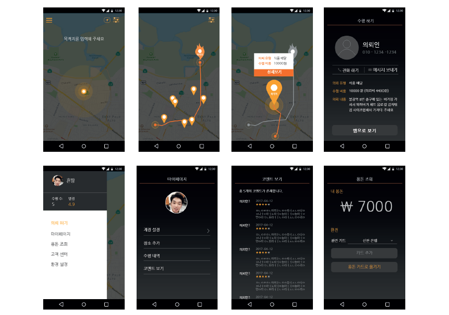

## NodeJS Application

# Introduction
> This is an Online to Off-line service for university studnets to earn thier pocket money. 
- You can run errands to earn your pockey money when you go and back to somewhere. 
- For example, you might go to your university or work place or house today. At the moment, you can use this application.

# How to use?
- When you go to the house from the university, you can set the point of departure and destination.
- Then, some pins will appear on the Google map in your mobile phone.
- That pins mean work that you can do during your way to destination.
- Of course, you also can make errands for your convenience at home.

# Screen Shot

# Spec
> Native application for IOS, Android users.
- Front-End : IOS, Android
- Back-End : NodeJS, AWS Infra, MySQL 
